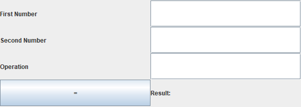
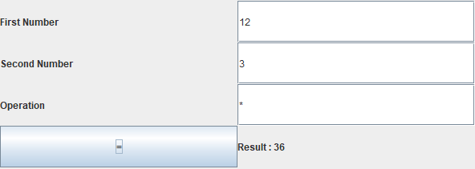

# Calculator Project with Java Swing and Sockets

## Overview

This project implements a basic calculator with a graphical user interface using Java Swing. The calculator performs calculations on the server side by establishing a socket connection between the client and server.

## Features

- **Graphical User Interface:** The calculator provides a simple and intuitive GUI for users to input mathematical expressions. 🖩

- **Socket Communication:** The calculator uses socket communication to send mathematical expressions from the client to the server for calculation. 📡

- **Server-side Calculation:** The server performs the actual calculation based on the received expression and sends back the result to the client. 🖥️

## Requirements

- Java Development Kit (JDK) installed on both client and server machines. ☕

## Usage

1. **Compile the Server and Client:**

   ```bash
   javac Server.java
   javac Client.java
   ```

2. **Run the Server:**

   ```bash
   java Server
   ```

3. **Run the Client:**

   ```bash
   java Client
   ```

4. **Use the Calculator:**
   - Enter mathematical expressions in the GUI on the client side.
   - Press the "Calculate" button to send the expression to the server.
   - The server will process the expression and send back the result.
   - The result will be displayed on the client interface.

## Screenshots

| Client GUI                       | Results                       |
| -------------------------------- | ----------------------------- |
|  |  |

## License

This project is licensed under the [MIT License](LICENSE). 📄

```

Feel free to customize it further according to your preferences!
```
